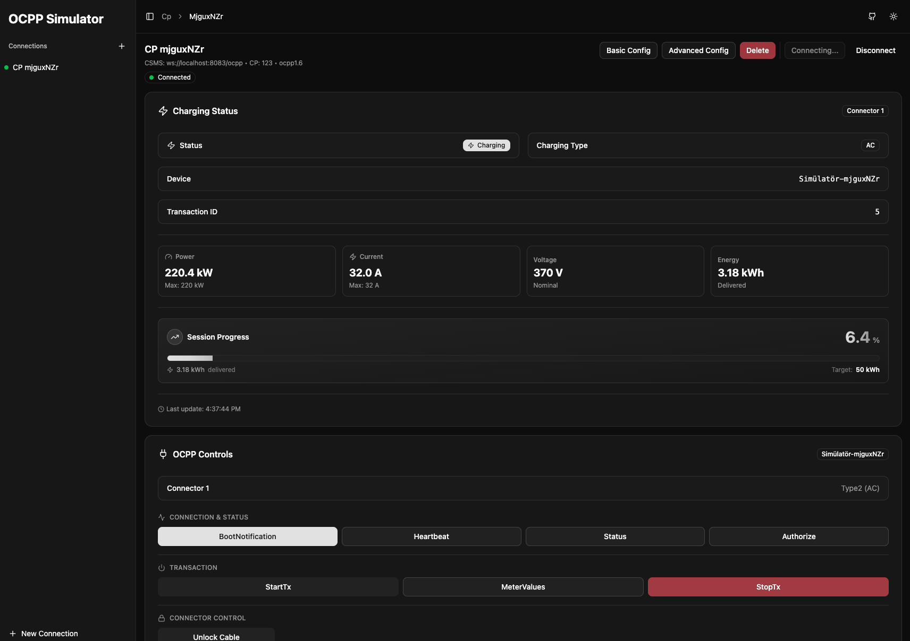
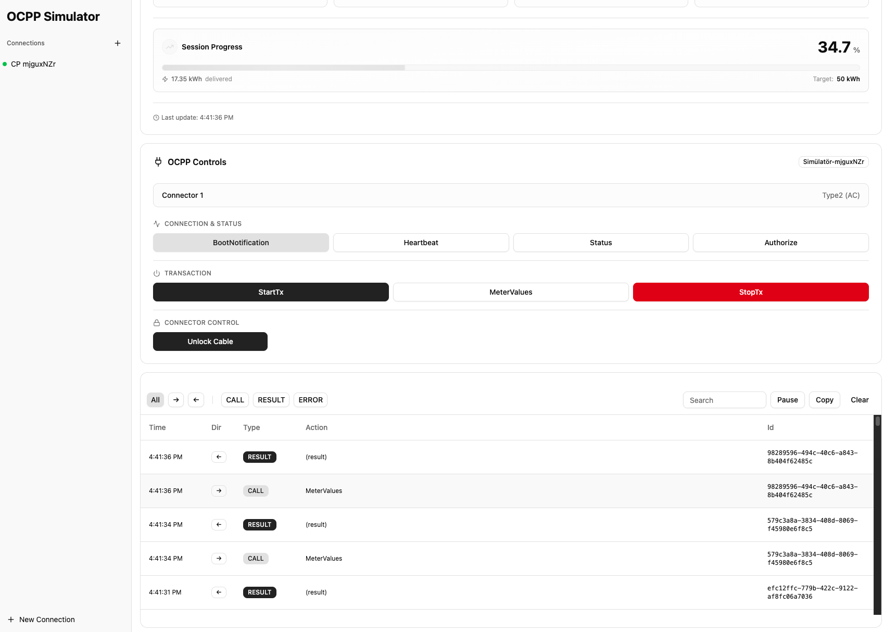
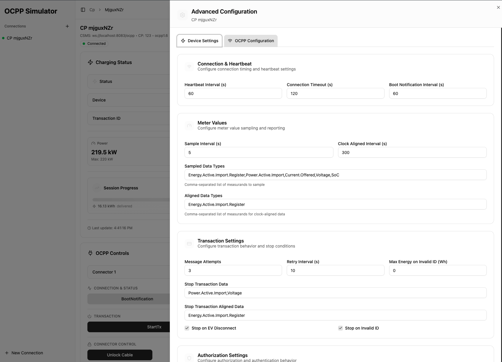

# OCPP Simulator

A web-based application for simulating Electric Vehicle (EV) charging stations and testing OCPP communication with Charge Station Management Systems (CSMS).

## Table of Contents

- [What is OCPP?](#what-is-ocpp)
- [Getting Started](#getting-started)
- [Creating a Charge Point Connection](#creating-a-charge-point-connection)
- [Connecting to CSMS](#connecting-to-csms)
- [Using OCPP Controls](#using-ocpp-controls)
- [Monitoring Charging Status](#monitoring-charging-status)
- [Network Traffic Monitoring](#network-traffic-monitoring)
- [Configuration Options](#configuration-options)
- [Managing Charge Points](#managing-charge-points)

## What is OCPP?

**OCPP (Open Charge Point Protocol)** is an open communication standard that enables EV charging stations (Charge Points) to communicate with a central management system (CSMS - Charge Station Management System). 

This protocol allows:
- Remote monitoring and control of charging stations
- Transaction management and authorization
- Real-time meter value reporting
- Firmware updates and configuration management
- Status notifications and diagnostics

This simulator implements **OCPP 1.6** and allows you to test your CSMS by simulating one or multiple charge points, sending OCPP messages, and monitoring the communication flow.

## UI Overview

The application features a modern, intuitive interface for managing charge points and monitoring OCPP communication:



*Charge Point Connection Interface - View real-time charging status, control OCPP messages, and manage connections*

## Getting Started

### Prerequisites

- Node.js (v18 or higher)
- Yarn package manager

### Installation

1. Install dependencies:
```bash
yarn install
```

2. Start the development server:
```bash
yarn dev
```

3. Open your browser and navigate to the URL shown in the terminal (typically `http://localhost:5173`)

## Creating a Charge Point Connection

1. **Open the sidebar** - Click the sidebar toggle button in the top-left corner if it's collapsed
2. **Click "New Connection"** - Use the button in the sidebar footer or the "+" button next to "Connections"
3. **Fill in the connection details**:
   - **Name** (optional): A friendly name for this charge point (e.g., "Test Station 1")
   - **CSMS URL**: The WebSocket URL of your CSMS server (e.g., `ws://localhost:9000/ocpp/` or `wss://example.com/ocpp/`)
   - **CP ID**: The unique identifier for this charge point (e.g., `SIM_001`)
4. **Click "Create"** - The charge point will be created and you'll be automatically navigated to its connection page

The connection will attempt to auto-connect immediately after creation.

## Connecting to CSMS

Once you've created a charge point, you can manage its connection:

1. **View connection status** - The status indicator shows:
   - 🟢 **Green**: Connected
   - 🟡 **Yellow**: Connecting
   - ⚪ **Gray**: Disconnected

2. **Manual connection**:
   - Click the **"Connect"** button in the top-right action bar
   - Wait for the status to change to "connected"

3. **Disconnect**:
   - Click the **"Disconnect"** button to close the WebSocket connection

## Using OCPP Controls

The **OCPP Controls** panel provides buttons to send various OCPP messages to your CSMS:

### Basic Messages

- **BootNotification**: Registers the charge point with the CSMS. Should be sent after connection.
- **Heartbeat**: Keeps the connection alive and provides current timestamp.
- **Status**: Sends a StatusNotification with connector status (Available, Occupied, etc.).
- **Authorize**: Authorizes an RFID tag for charging.

### Transaction Management

- **StartTx**: 
  - Authorizes the configured ID tag
  - Starts a charging transaction
  - Begins sending periodic MeterValues
  - Changes connector status to "Charging"

- **MeterValues**: Manually sends current meter readings (power, energy, voltage, current, SoC).

- **StopTx**: 
  - Stops the active transaction
  - Sends final meter values
  - Changes connector status to "Finishing"

- **Unlock Cable**: Changes connector status back to "Available" after charging.

### Usage Flow

A typical charging session flow:

1. **Connect** to CSMS
2. **BootNotification** - Register the charge point
3. **Authorize** - Verify the RFID tag (optional, StartTx does this automatically)
4. **StartTx** - Begin charging session
5. Monitor **MeterValues** being sent automatically
6. **StopTx** - End the charging session
7. **Unlock Cable** - Make connector available again

## Monitoring Charging Status

The **Charging Status** panel displays real-time information:

- **Status**: Current charging state (Charging / Not Charging)
- **Charging Type**: AC or DC charging
- **Device**: Device name from configuration
- **Transaction ID**: Active transaction identifier
- **Battery SoC** (DC only): State of Charge percentage with progress bar
- **Power**: Current power draw in kW
- **Current**: Current in Amperes
- **Voltage**: Voltage in Volts
- **Energy**: Total energy delivered in kWh
- **Session Progress** (AC): Progress bar showing charging session completion

All values update automatically as MeterValues are received.

## Network Traffic Monitoring

The **Network Traffic** panel shows all OCPP messages exchanged between the charge point and CSMS:



*Real-time OCPP message monitoring with detailed JSON payload inspection*

- **Incoming messages** (from CSMS): Displayed with incoming indicators
- **Outgoing messages** (to CSMS): Displayed with outgoing indicators
- **Message details**: Click on any message to view its full JSON payload
- **Pause/Resume**: Toggle to pause automatic scrolling when new messages arrive
- **Copy**: Copy all messages as JSON to clipboard
- **Clear**: Remove all messages from the log

This is useful for debugging and understanding the OCPP message flow.

## Configuration Options

### Basic Configuration

Click **"Basic Config"** to edit:
- **Name**: Charge point display name
- **CSMS URL**: WebSocket server URL
- **CP ID**: Charge point identifier
- **Protocol**: OCPP version (1.6 or 2.0.1)

### Advanced Configuration

Click **"Advanced Config"** to configure:



*Comprehensive configuration interface with modular sections for device settings and OCPP parameters*

- **Device Settings**: Device name, power limits, voltage, current, connector types, AC/DC mode
- **OCPP Configuration**: Heartbeat interval, meter value intervals, feature profiles, authorization settings, and more

Changes to configuration are saved locally and persist across sessions.

## Managing Charge Points

### Viewing All Connections

- All created charge points appear in the sidebar under "Connections"
- Each entry shows:
  - Connection status indicator (green/yellow/gray dot)
  - Charge point name or label

### Switching Between Charge Points

- Click any charge point in the sidebar to navigate to its connection page
- You can have multiple charge points connected simultaneously

### Deleting a Charge Point

1. Navigate to the charge point's connection page
2. Click the **"Delete"** button in the top-right action bar
3. Confirm deletion in the dialog
4. The charge point will be removed and disconnected

### Renaming a Charge Point

1. Open **"Basic Config"**
2. Change the **Name** field
3. Click **"Save changes"**

## Tips

- **Multiple Simulations**: Create multiple charge points to simulate a charging network
- **Testing Scenarios**: Use different CP IDs and configurations to test various scenarios
- **Network Debugging**: Use the Network Traffic panel to inspect exact OCPP message formats
- **Battery Simulation**: The app simulates battery charging for DC mode with realistic SoC progression
- **Auto-Connect**: Charge points attempt to auto-connect when you navigate to their page

## Development

### Build for Production

```bash
yarn build
```

### Preview Production Build

```bash
yarn preview
```

### Linting

```bash
yarn lint
```

